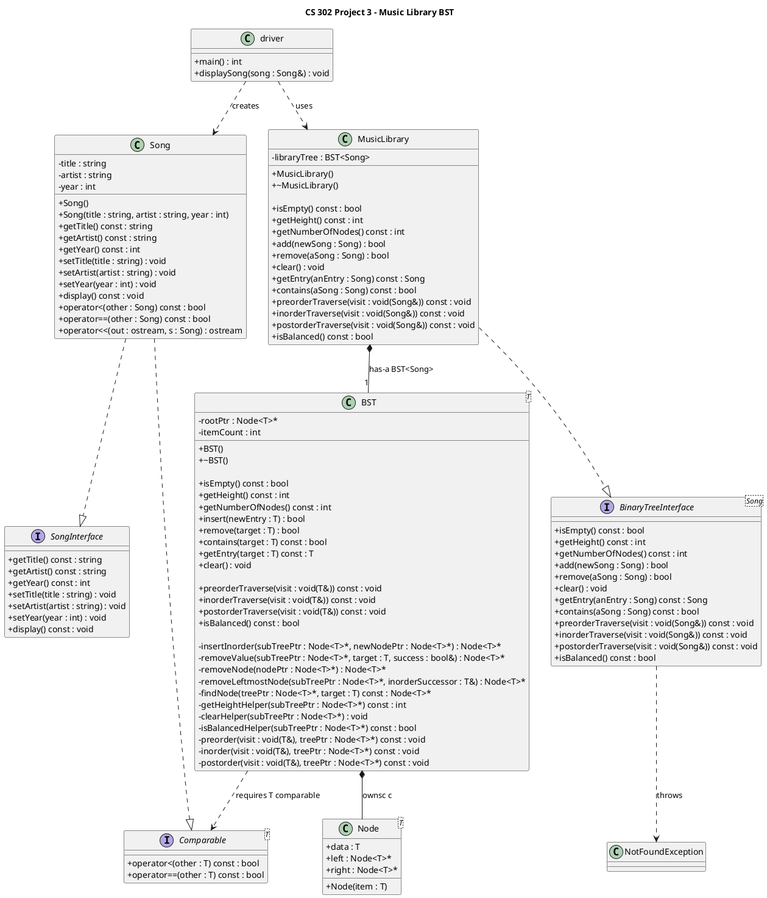

# ADT Design: Music Library BST

## 1. Purpose

The purpose of the Music Library BST ADT is to store, organize, and manage a collection of songs so they can be added, searched, retrieved, displayed, and removed efficiently.

This ADT solves the problem of maintaining a music library in **alphabetical order by title** while also supporting common library operations such as:
- adding songs
- checking whether a song exists
- retrieving a specific song
- removing songs
- displaying the collection in different traversal orders
- checking whether the tree is balanced

The ADT presents a clean, high-level interface for working with songs as a collection, without exposing internal implementation details.

---

## 2. Logical Data Model

Logically, the Music Library is a collection of `Song` objects.

Each song stores:
- a **title**
- an **artist**
- a **year**

The collection is maintained according to a **binary search tree ordering rule based on song title**:

- Titles that compare as smaller come before a given song
- Titles that compare as larger come after a given song

This logical model allows the collection to remain ordered by title while supporting efficient search, retrieval, insertion, and removal.

From the user’s perspective, the Music Library behaves as an ordered collection of songs that can be traversed in preorder, inorder, or postorder.

This ADT does **not** expose how the collection is physically stored in memory.

---

## 3. Operations

## `bool isEmpty() const`
**What it does:**  
Returns whether the music library currently contains any songs.

**What it returns:**  
- `true` if the library contains no songs
- `false` otherwise

**Edge cases:**  
- On a newly created library, this returns `true`
- After all songs are removed, this returns `true`

---

## `int getHeight() const`
**What it does:**  
Returns the height of the music library.

**What it returns:**  
- The height of the tree
- `0` if the library is empty

**Edge cases:**  
- On an empty tree, returns `0`

---

## `int getNumberOfNodes() const`
**What it does:**  
Returns the total number of songs currently stored in the library.

**What it returns:**  
- The number of songs in the collection

**Edge cases:**  
- On an empty tree, returns `0`

---

## `bool add(const Song& newData)`
**What it does:**  
Adds a new song to the library according to the BST ordering rule.

**What it returns:**  
- `true` if the song is added successfully
- `false` otherwise

**Edge cases:**  
- If the library is empty, the new song becomes the first stored item
- If duplicate titles are provided, they are placed according to the tree’s comparison behavior
- In this project’s test data, duplicate titles are avoided

---

## `bool remove(const Song& data)`
**What it does:**  
Removes the song matching the given title from the library.

**What it returns:**  
- `true` if the song was found and removed
- `false` if the song was not found

**Edge cases:**  
- If the tree is empty, returns `false`
- If the title is not found, the tree remains unchanged
- If the song has no children, it is removed directly
- If the song has one child, it is replaced by that child
- If the song has two children, it is replaced by its inorder successor

---

## `void clear()`
**What it does:**  
Removes all songs from the library.

**What it returns:**  
- Nothing

**Edge cases:**  
- If the tree is already empty, the operation has no effect

---

## `Song getEntry(const Song& anEntry) const`
**What it does:**  
Searches for a song matching the given title and returns the stored song.

**What it returns:**  
- The matching `Song` object if found

**Edge cases:**  
- If the tree is empty, throws `NotFoundException`
- If the title is not found, throws `NotFoundException`

---

## `bool contains(const Song& anEntry) const`
**What it does:**  
Checks whether a song matching the given title exists in the library.

**What it returns:**  
- `true` if the song is found
- `false` otherwise

**Edge cases:**  
- If the tree is empty, returns `false`
- If the title is not found, returns `false`

---

## `void preorderTraverse(void visit(Song&)) const`
**What it does:**  
Traverses the library in preorder and applies the given visit function to each song.

**Traversal order:**  
- root
- left subtree
- right subtree

**What it returns:**  
- Nothing

**Edge cases:**  
- If the tree is empty, no songs are visited

---

## `void inorderTraverse(void visit(Song&)) const`
**What it does:**  
Traverses the library in inorder and applies the given visit function to each song.

**Traversal order:**  
- left subtree
- root
- right subtree

**What it returns:**  
- Nothing

**Behavioral note:**  
- Because the tree is ordered by title, inorder traversal visits songs in alphabetical order by title

**Edge cases:**  
- If the tree is empty, no songs are visited

---

## `void postorderTraverse(void visit(Song&)) const`
**What it does:**  
Traverses the library in postorder and applies the given visit function to each song.

**Traversal order:**  
- left subtree
- right subtree
- root

**What it returns:**  
- Nothing

**Edge cases:**  
- If the tree is empty, no songs are visited

---

## `bool isBalanced() const`
**What it does:**  
Checks whether the library is height-balanced.

A tree is balanced if, for every song in the collection, the heights of the left and right subcollections differ by no more than 1.

**What it returns:**  
- `true` if the tree is balanced
- `false` otherwise

**Edge cases:**  
- An empty tree is considered balanced

---

## 4. Behavioral Guarantees

### Ordering rule
Songs are placed in the tree according to **title**.

- If a new song’s title is less than the current song’s title, it is placed in the left subcollection
- If a new song’s title is greater, it is placed in the right subcollection

This ordering rule determines the logical position of every song in the library.

---

### Behavior when `remove()` does not find a title
If `remove()` is called with a song title that is not in the library:
- the method returns `false`
- the library remains unchanged

---

### Behavior when `contains()` does not find a title
If `contains()` is called with a song title that is not in the library:
- the method returns `false`

If the library is empty, it also returns `false`.

---

### Behavior when `getEntry()` does not find a title
If `getEntry()` is called with a song title that is not in the library:
- the method throws `NotFoundException`

If the library is empty, it also throws `NotFoundException`.

---

### BST ordering invariant
The BST ordering invariant is:

- every song in the left subcollection of a song has a title that compares less than that song’s title
- every song in the right subcollection of a song has a title that compares greater than or equal to that song’s title, according to the implementation’s comparison behavior

This invariant is maintained after every insert and remove because:
- `add()` places each new song according to the title comparison rule
- `remove()` preserves ordering by reconnecting subcollections correctly
- in the two-children removal case, the removed song is replaced by its inorder successor, which preserves the inorder ordering of titles

## UML Diagram

