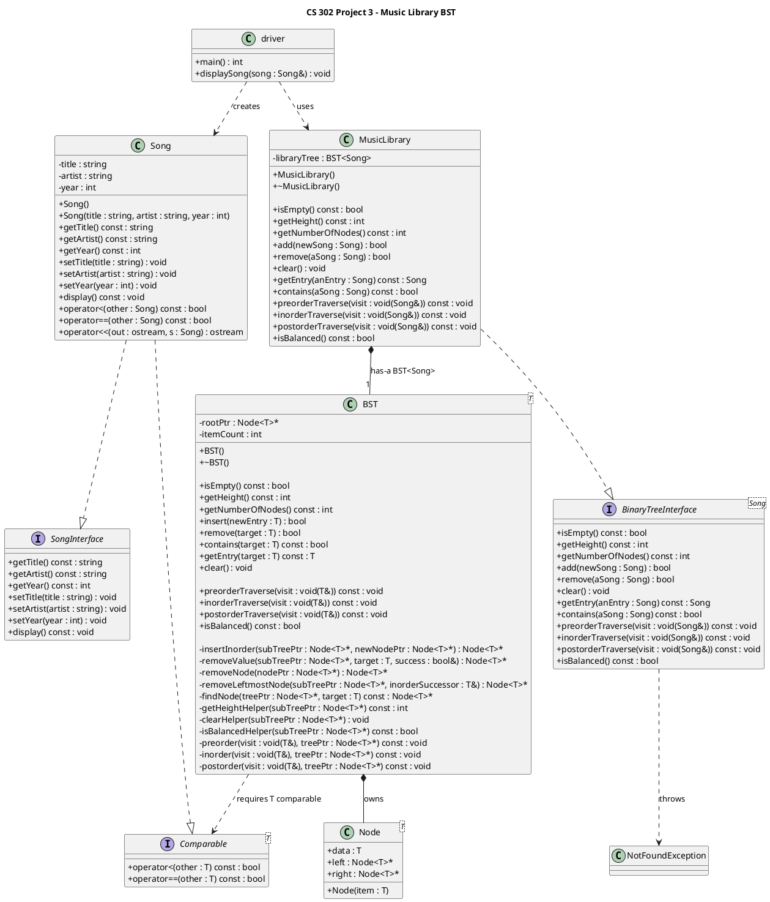

```plantuml
@startuml
title CS 302 Project 3 - Music Library BST

skinparam classAttributeIconSize 0

'========================
' Interfaces / Contracts
'========================

interface "Comparable<T>" as ComparableT {
    +operator<(other : T) const : bool
    +operator==(other : T) const : bool
}

interface SongInterface {
    +getTitle() const : string
    +getArtist() const : string
    +getYear() const : int
    +setTitle(title : string) : void
    +setArtist(artist : string) : void
    +setYear(year : int) : void
    +display() const : void
}

interface "BinaryTreeInterface<Song>" as BinaryTreeSong {
    +isEmpty() const : bool
    +getHeight() const : int
    +getNumberOfNodes() const : int
    +add(newSong : Song) : bool
    +remove(aSong : Song) : bool
    +clear() : void
    +getEntry(anEntry : Song) const : Song
    +contains(aSong : Song) const : bool
    +preorderTraverse(visit : void(Song&)) const : void
    +inorderTraverse(visit : void(Song&)) const : void
    +postorderTraverse(visit : void(Song&)) const : void
    +isBalanced() const : bool
}

class NotFoundException

'========================
' Song
'========================

class Song {
    -title : string
    -artist : string
    -year : int
    +Song()
    +Song(title : string, artist : string, year : int)
    +getTitle() const : string
    +getArtist() const : string
    +getYear() const : int
    +setTitle(title : string) : void
    +setArtist(artist : string) : void
    +setYear(year : int) : void
    +display() const : void
    +operator<(other : Song) const : bool
    +operator==(other : Song) const : bool
    +operator<<(out : ostream, s : Song) : ostream
}

Song ..|> SongInterface
Song ..|> ComparableT

'========================
' Templated BST + Node
'========================

class "Node<T>" as NodeT {
    +data : T
    +left : Node<T>*
    +right : Node<T>*
    +Node(item : T)
}

class "BST<T>" as BSTT {
    -rootPtr : Node<T>*
    -itemCount : int

    +BST()
    +~BST()

    +isEmpty() const : bool
    +getHeight() const : int
    +getNumberOfNodes() const : int
    +insert(newEntry : T) : bool
    +remove(target : T) : bool
    +contains(target : T) const : bool
    +getEntry(target : T) const : T
    +clear() : void

    +preorderTraverse(visit : void(T&)) const : void
    +inorderTraverse(visit : void(T&)) const : void
    +postorderTraverse(visit : void(T&)) const : void
    +isBalanced() const : bool

    -insertInorder(subTreePtr : Node<T>*, newNodePtr : Node<T>*) : Node<T>*
    -removeValue(subTreePtr : Node<T>*, target : T, success : bool&) : Node<T>*
    -removeNode(nodePtr : Node<T>*) : Node<T>*
    -removeLeftmostNode(subTreePtr : Node<T>*, inorderSuccessor : T&) : Node<T>*
    -findNode(treePtr : Node<T>*, target : T) const : Node<T>*
    -getHeightHelper(subTreePtr : Node<T>*) const : int
    -clearHelper(subTreePtr : Node<T>*) : void
    -isBalancedHelper(subTreePtr : Node<T>*) const : bool
    -preorder(visit : void(T&), treePtr : Node<T>*) const : void
    -inorder(visit : void(T&), treePtr : Node<T>*) const : void
    -postorder(visit : void(T&), treePtr : Node<T>*) const : void
}

BSTT *-- NodeT : owns

'========================
' MusicLibrary
'========================

class MusicLibrary {
    -libraryTree : BST<Song>
    +MusicLibrary()
    +~MusicLibrary()

    +isEmpty() const : bool
    +getHeight() const : int
    +getNumberOfNodes() const : int
    +add(newSong : Song) : bool
    +remove(aSong : Song) : bool
    +clear() : void
    +getEntry(anEntry : Song) const : Song
    +contains(aSong : Song) const : bool
    +preorderTraverse(visit : void(Song&)) const : void
    +inorderTraverse(visit : void(Song&)) const : void
    +postorderTraverse(visit : void(Song&)) const : void
    +isBalanced() const : bool
}

MusicLibrary ..|> BinaryTreeSong
MusicLibrary *-- "1" BSTT : has-a BST<Song>

'========================
' Driver usage
'========================

class driver {
    +main() : int
    +displaySong(song : Song&) : void
}

driver ..> MusicLibrary : uses
driver ..> Song : creates
BinaryTreeSong ..> NotFoundException : throws
BSTT ..> ComparableT : requires T comparable

@enduml
```
